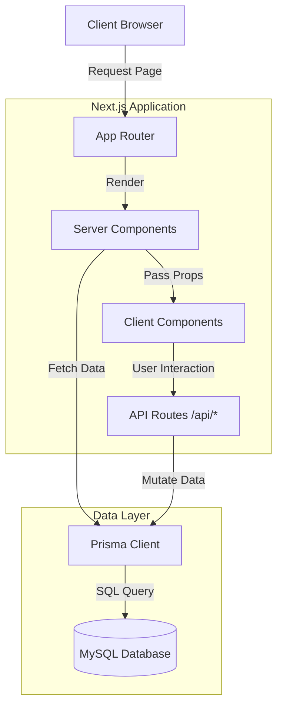
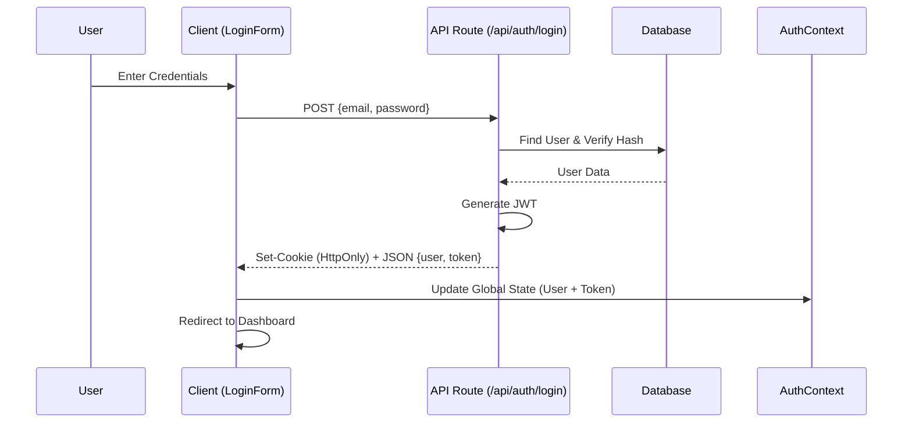
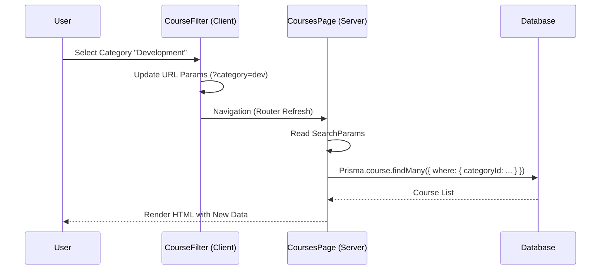
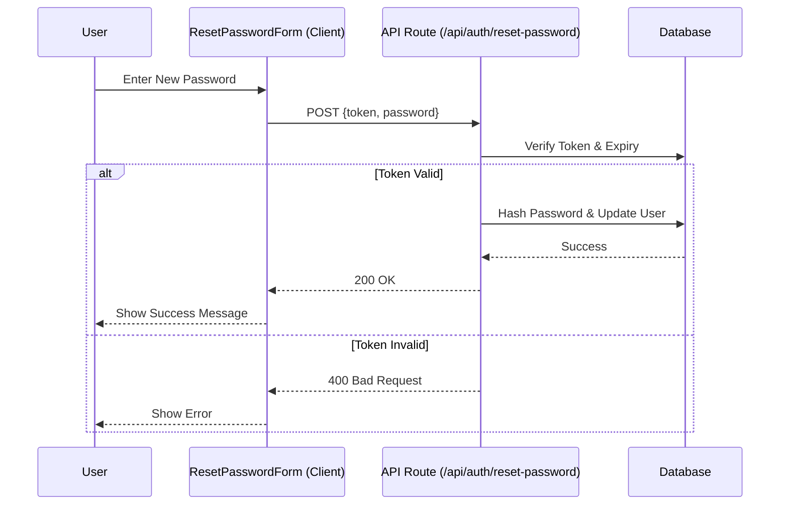

# Comprehensive System Analysis

## 1. Executive Summary

The **DoDaveAcademy** platform is currently transitioning from a Symfony-based architecture to a modern **Next.js 16 (App Router)** application. The system leverages **Prisma ORM** with **MySQL** for data persistence and **React Server Components (RSC)** for performance-critical data fetching.

While the core authentication and course browsing features are implemented using modern patterns, a significant portion of the UI components (`components/generated`) appears to be ported directly from the legacy system, creating a hybrid state that requires standardization.

---

## 2. System Architecture

### 2.1 High-Level Architecture

### 2.2 Key Technologies

-   **Framework**: Next.js 16.1.6 (App Router)
-   **Language**: TypeScript
-   **Database ORM**: Prisma 5.22.0
-   **Authentication**: Custom JWT Implementation (HttpOnly Cookies + Context)
-   **Styling**: Tailwind CSS 4 + Bootstrap (Legacy classes visible)
-   **State Management**: React Context (`AuthContext`) + URL Search Params

---

## 3. Component Analysis

### 3.1 Data Layer (Entities)

The database schema (`prisma/schema.prisma`) is rich and complex, supporting a full-featured LMS.

| Entity Domain | Key Models | Responsibilities |
| :--- | :--- | :--- |
| **Identity** | `User`, `Person`, `Student`, `Instructor` | Manages user profiles, roles, and hierarchy. `User` is the central auth entity. |
| **Content** | `Course`, `Chapter`, `Lesson`, `Media` | Structures the learning material. `Course` is the aggregate root. |
| **Taxonomy** | `Category`, `SkillLevel`, `Tag` | Classification of courses for filtering and search. |
| **Learning** | `Lecture`, `Quiz`, `Exam`, `Review` | Tracks student progress (`Lecture`), assessments, and feedback. |
| **Commerce** | `Subscription`, `Payment`, `Order` | Manages monetization, enrollments, and access control. |

### 3.2 Frontend Layer

The frontend architecture is split between **Server** and **Client** components:

1.  **Server Components (Data Fetchers)**
    -   Located in `app/**/page.tsx`.
    -   **Responsibility**: Direct database access via `lib/prisma.ts`.
    -   **Example**: `app/courses/page.tsx` fetches filtered courses, categories, and levels in parallel using `Promise.all`.

2.  **Client Components (Interactive UI)**
    -   Located in `components/**`.
    -   **Responsibility**: User interaction, state management, API calls.
    -   **Example**: `CourseFilter.tsx` manages URL parameters for filtering; `LoginForm.tsx` handles auth submission.

3.  **Legacy/Generated Components**
    -   Located in `components/generated/**`.
    -   **Status**: Appears to be a direct port from Twig templates. May rely on outdated patterns or missing sub-components.

### 3.3 API Layer

Located in `app/api/**`. Currently sparse, primarily focusing on authentication and some data retrieval.

-   **Auth Routes**: `/api/auth/login`, `/api/auth/register`, `/api/auth/forgot-password`.
-   **Data Routes**: `/api/courses` (Client-side search), `/api/categories`.
-   **Validation**: Currently manual (no Zod/Yup detected).
-   **Error Handling**: Basic `try/catch` blocks returning JSON responses.

---

## 4. Interaction Patterns & Data Flow

### 4.1 Authentication Flow

Standard JWT-based flow with a hybrid storage approach (HttpOnly Cookie for Server, LocalStorage for Client Context).

**Critique**: Storing the token in `localStorage` (via `AuthContext`) *and* HttpOnly cookies is redundant and potentially less secure (XSS risk for localStorage). Recommended to rely solely on HttpOnly cookies and use a `/api/auth/me` endpoint to fetch user details.

### 4.2 Course Browsing & Filtering

Uses **URL-Driven State** pattern, which is excellent for shareability and SEO.

**Performance**: This pattern is efficient as it leverages Server Components. However, full page navigation might feel slower than client-side filtering for small datasets.

### 4.3 Data Mutation (e.g., Reset Password)

---

## 5. Gap Analysis & Recommendations

| Area | Observation | Risk | Recommendation |
| :--- | :--- | :--- | :--- |
| **Validation** | Manual checks (e.g., `if (!email)`) in API routes. | High (Security/Data Integrity) | Adopt **Zod** for schema validation in all API routes and Server Actions. |
| **Error Handling** | Basic `try/catch` in individual routes. No global error boundary visible. | Medium (UX) | Implement `app/global-error.tsx` and standardize API error responses. |
| **Legacy Code** | `components/generated` contains thousands of files, potentially unused or unoptimized. | High (Maintainability) | Audit and progressively refactor/delete these files. Replace with modern React components. |
| **Type Safety** | Some usage of `any` (recently fixed some, but likely more exist). | Medium (Stability) | Enforce strict TypeScript checks and generate types from Prisma schema. |
| **Security** | Auth token stored in LocalStorage. | Medium (XSS) | Move to pure HttpOnly cookie-based auth. Remove token from client-side JS access. |

## 6. Interaction Matrix

| Interaction | Source | Destination | Protocol | Payload |
| :--- | :--- | :--- | :--- | :--- |
| **Login** | `LoginForm.tsx` | `/api/auth/login` | HTTP POST | JSON `{email, password}` |
| **Register** | `RegisterForm.tsx` | `/api/auth/register` | HTTP POST | JSON `{email, password, name, ...}` |
| **Fetch Courses** | `app/courses/page.tsx` | `lib/prisma.ts` | Direct DB Call | Prisma Query Object |
| **Search Courses** | `app/courses/page.tsx` | `URLSearchParams` | Next.js Router | Query String |
| **Reset Password** | `ResetPasswordForm.tsx` | `/api/auth/reset-password` | HTTP POST | JSON `{token, password}` |

