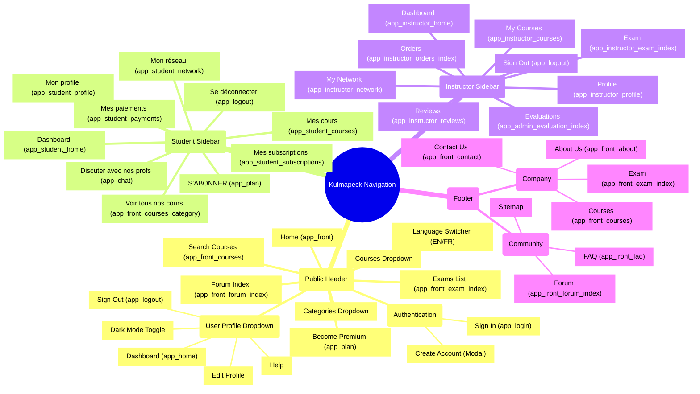

# Kulmapeck Navigation Structure

This document provides a comprehensive visual mindmap of the application's navigation structure based on the codebase configuration. It covers the Public Header, Student Sidebar, Instructor Sidebar, and Footer links.

## Visual Mindmap

## Detailed Navigation Breakdown

### 1. Public Header (Navbar)
Located in `templates/front/base.html.twig`. Available to all visitors.
*   **Logo & Home**: Direct access to the landing page (`app_front`).
*   **Categories & Courses**: Dynamic dropdowns rendering categories and course lists via `app_front_header_categories` and `app_front_header_courses_and_formations`.
*   **Examens**: Access to public exam listings (`app_front_exam_index`).
*   **Forum**: Access to the community forum (`app_front_forum_index`).
*   **Premium Actions**: "Become Premium" link (`app_plan`) appears for non-premium users.
*   **Search**: Global search bar targeting courses (`app_front_courses`).
*   **User Menu**: Dropdown providing access to the user-specific dashboard (`app_home`), profile settings, and logout.

### 2. Student Sidebar
Located in `templates/student/base.html.twig`. Specific to users with `ROLE_STUDENT`.
*   **Dashboard**: Main student overview (`app_student_home`).
*   **Learning**: Access to course catalog (`app_front_courses_category`) and enrolled courses (`app_student_courses`).
*   **Account Management**: Subscription plans (`app_student_subscriptions`), payments (`app_student_payments`), and profile settings (`app_student_profile`).
*   **Social & Support**: Networking (`app_student_network`) and direct chat with teachers (`app_chat`).

### 3. Instructor Sidebar
Located in `templates/instructor/base.html.twig`. Specific to users with `ROLE_INSTRUCTOR`.
*   **Management**: Dashboard (`app_instructor_home`) and course management (`app_instructor_courses`).
*   **Sales & Performance**: Order tracking (`app_instructor_orders_index`) and student reviews (`app_instructor_reviews`).
*   **Assessment**: Exam creation (`app_instructor_exam_index`) and evaluations (`app_admin_evaluation_index`).
*   **Profile**: Instructor profile settings (`app_instructor_profile`).

### 4. Footer
Located in `templates/front/base.html.twig`.
*   **Company**: Standard information links (About, Contact).
*   **Community**: Help resources (FAQ, Forum).
