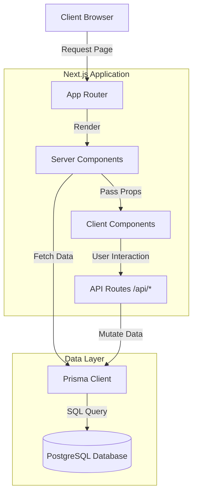
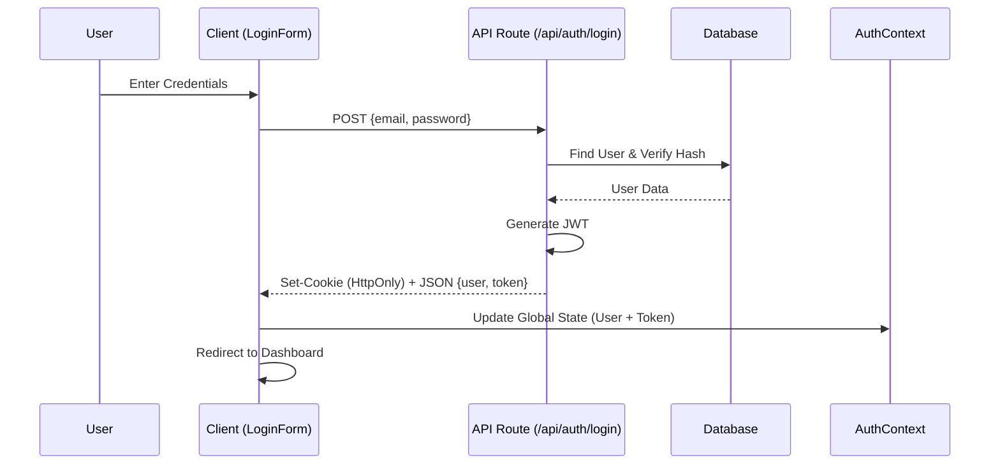
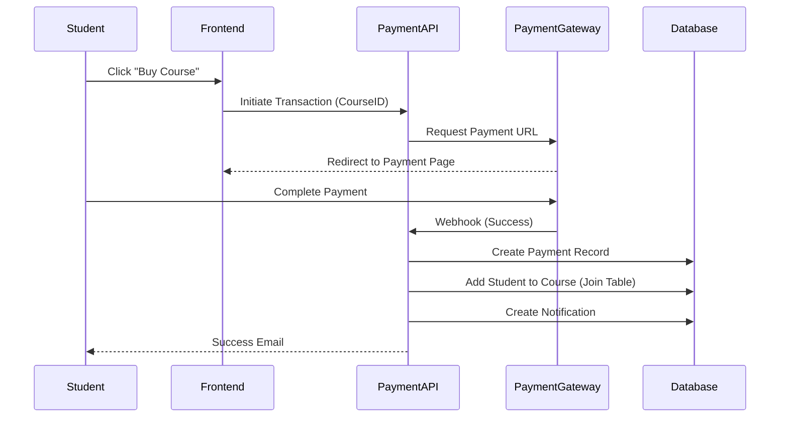
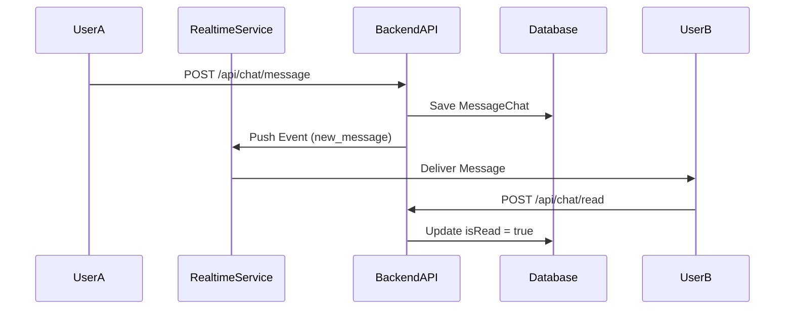

# System Architecture & Comprehensive Analysis

This document outlines the architecture of the DoDave Academy platform, mapping the legacy Symfony implementation to the new Next.js structure, and provides a comprehensive analysis of the system components, data flows, and migration status.

## 1. Executive Summary

The **DoDaveAcademy** platform is transitioning from a Symfony-based architecture to a modern **Next.js 16 (App Router)** application. The system leverages **Prisma ORM** with **PostgreSQL** for data persistence and **React Server Components (RSC)** for performance-critical data fetching.

While the core authentication and course browsing features are implemented using modern patterns, a significant portion of the UI components (`components/generated`) serves as a bridge from the legacy system, requiring progressive standardization.

## 2. High-Level Architecture

### 2.1 Architecture Diagram

### 2.2 Technical Stack Mapping

| Component | Legacy (Symfony) | Target (React/Next.js) | Notes |
|-----------|-------------------|------------------------|-------|
| **Language** | PHP 8.1 | TypeScript | Strict typing for better maintainability. |
| **Framework** | Symfony 6.2 | Next.js 14+ (App Router) | Server Components for performance. |
| **Frontend** | Twig Templates | React Components (TSX) | Reusable UI components. |
| **Styling** | Bootstrap / Custom CSS | Tailwind CSS | Utility-first, faster development. |
| **API** | API Platform | Next.js Route Handlers / Server Actions | Integrated API within the frontend app. |
| **Database** | PostgreSQL (Doctrine) | PostgreSQL (Prisma) | Prisma provides excellent TS support. |
| **Real-time** | Ratchet (PHP WebSocket) | Supabase Realtime / Pusher | Managed services are easier to scale. |
| **Auth** | Symfony Security / JWT | NextAuth.js / Custom JWT | Supports OAuth and Credentials. |
| **Hosting** | VPS / Dedicated | Vercel / Edge | Serverless, globally distributed. |

## 3. Component Analysis

### 3.1 Data Layer (Entities)
The database schema (`prisma/schema.prisma`) supports a full-featured LMS:
- **Identity**: `User`, `Person`, `Student`, `Instructor`. `User` is the central auth entity.
- **Content**: `Course`, `Chapter`, `Lesson`, `Media`. `Course` is the aggregate root.
- **Taxonomy**: `Category`, `SkillLevel`, `Tag`.
- **Learning**: `Lecture` (progress), `Quiz`, `Exam`, `Review`.
- **Commerce**: `Subscription`, `Payment`, `Order`.

### 3.2 Frontend Layer
The frontend architecture is split between **Server** and **Client** components:
1.  **Server Components (Data Fetchers)**: Located in `app/**/page.tsx`. Directly access DB via `lib/prisma.ts`.
2.  **Client Components (Interactive UI)**: Located in `components/**`. Handle user interaction and API calls.
3.  **Legacy/Generated Components**: Located in `components/generated/**`. Direct ports from Twig templates.

### 3.3 API Layer
Located in `app/api/**`.
- **Auth Routes**: `/api/auth/login`, `/api/auth/register`, `/api/auth/forgot-password`.
- **Data Routes**: `/api/courses` (Search), `/api/categories`.
- **Migration Strategy**: Logic from Symfony Controllers should move to **Server Actions** or **Route Handlers**.

## 4. Entity Interaction Matrix (Core Relationships)

The following matrix illustrates the primary dependencies between key system entities.
**Legend:** `1:1` (One-to-One), `1:N` (One-to-Many), `N:N` (Many-to-Many), `Dep` (Dependency).

| Entity | User | Profile | Student | Instructor | Course | Program | Payment | Assessment | Forum | Chat |
| :--- | :---: | :---: | :---: | :---: | :---: | :---: | :---: | :---: | :---: | :---: |
| **User** | - | 1:1 | 1:1 | 1:1 | 1:N (Author) | - | 1:N | - | 1:N (Post) | 1:N (Msg) |
| **Profile** | 1:1 | - | - | - | - | - | - | - | - | - |
| **Student** | 1:1 | Dep | - | - | N:N (Enroll) | N:N | 1:N | N:N | - | 1:N |
| **Instructor**| 1:1 | Dep | - | - | 1:N (Owner) | - | - | 1:N | - | 1:N |
| **Course** | Dep | - | N:N | Dep | - | N:N | 1:N | 1:N | 1:1 | 1:N |
| **Program** | - | - | N:N | - | N:N | - | - | - | - | - |
| **Payment** | Dep | - | Dep | - | Dep | - | - | - | - | - |
| **Assessment**| - | - | N:N | Dep | - | - | - | - | - | - |

## 5. Detailed Entity Functionality & Usage Scope

### 5.1 Identity & Access Management (IAM)

#### **User**
*   **Scope**: Central authentication entity. Handles credentials, roles, and account status.
*   **Features**: Login, Registration, Password Reset, Role Management (`ROLE_USER`, `ROLE_STUDENT`, `ROLE_INSTRUCTOR`, `ROLE_ADMIN`).
*   **Pages**: `/login`, `/register`, `/reset-password`, Admin Users List.
*   **Dependencies**: Linked to `Profile`, `Student`, `Instructor`.

#### **Profile** (formerly Personne)
*   **Scope**: Extended profile information common to all human users.
*   **Features**: Avatar management, Biography, Social links, Contact info.
*   **Pages**: User Profile, Instructor Public Profile.
*   **Dependencies**: `User` (Parent).

#### **Student** (formerly Eleve)
*   **Scope**: Specialized data for learners.
*   **Features**: Course enrollment, Progress tracking (`Lecture`), Quiz results (`QuizResult`), Payments history.
*   **Pages**: Student Dashboard, My Courses, My Grades.
*   **Relationships**: `User` (1:1), `Level` (Many:1), `Course` (Many:Many).

#### **Instructor** (formerly Enseignant)
*   **Scope**: Specialized data for content creators.
*   **Features**: Course creation, Student management, Revenue tracking, Verification status (`isValidated`).
*   **Pages**: Instructor Dashboard, Course Manager, Financials.
*   **Relationships**: `User` (1:1), `Institution` (Many:1), `Course` (1:Many).

### 5.2 Content Management System (LMS)

#### **Course** (formerly Cours)
*   **Scope**: The core learning unit.
*   **Features**: Curriculum structuring, Pricing, Media attachment, Publication workflow.
*   **Pages**: Course List, Course Detail, Course Player.
*   **Components**:
    *   **Chapter/Module**: Logical sections of a course.
    *   **Lesson**: Atomic content (Video, Text, Quiz).
*   **Dependencies**: `Category`, `Level`, `Instructor`.

#### **Program** (formerly Formation)
*   **Scope**: A collection of courses forming a curriculum or degree track.
*   **Features**: Bundled enrollment, Certification.
*   **Pages**: Program List, Program Detail.
*   **Relationships**: `Course` (Many:Many).

### 5.3 Assessment Engine

#### **Quiz & Exam**
*   **Scope**: Knowledge verification tools.
*   **Features**:
    *   `Quiz`: Auto-graded, attached to courses/chapters.
    *   `Exam`: Scheduled, official assessments.
*   **Entities**:
    *   `Quiz`: Container for questions.
    *   `Proposition`: Answers/Options.
    *   `QuizResult`: Stores student score and attempts.
*   **Pages**: Quiz Player, Exam Hall, Gradebook.

#### **Evaluation**
*   **Scope**: Official periodic assessments (e.g., end-of-term).
*   **Features**: Complex grading, Teacher corrections.
*   **Entities**: `EvaluationQuestion`, `EvaluationResultat`.

### 5.4 Communication Layer

#### **Forum**
*   **Scope**: Asynchronous Q&A linked to courses.
*   **Entities**:
    *   `Forum`: One per `Course`.
    *   `Topic` (Sujet): Discussion threads.
    *   `ForumMessage`: Replies.
*   **Pages**: Course Discussion Tab.

#### **Chat (Real-time)**
*   **Scope**: Instant messaging between students and teachers.
*   **Entities**:
    *   `SubjectChat`: Chat room (e.g., "Math 101").
    *   `MessageChat`: Individual messages.
    *   `WebSocketConnection`: Tracking online status.
*   **Services**: `SubjectChatService`, `WebSocketPusher` (migrating to Supabase Realtime).

## 6. Page & Feature Usage Map

### **Front-End (Public)**
| Page / Route | Controller (Legacy) | Primary Entities | Features |
| :--- | :--- | :--- | :--- |
| **Home** `/` | `Front\HomeController` | `Course`, `Review`, `Category` | Featured courses, Testimonials, Search. |
| **Courses** `/courses` | `Front\CoursesController` | `Course`, `Category` | Filtering, Pagination, Search. |
| **Course Detail** `/course/{slug}` | `Api\...\DetailsController` | `Course`, `Chapter`, `Lesson` | Curriculum view, Instructor info, Enrollment check. |
| **Login** `/login` | `SecurityController` | `User` | Authentication (JWT/Session). |
| **Register** `/register` | `RegistrationController` | `User`, `Student`, `Instructor` | Account creation, Email verification. |

### **Student Dashboard**
| Page / Route | Controller (Legacy) | Primary Entities | Features |
| :--- | :--- | :--- | :--- |
| **My Learning** | `Student\CourseController` | `Student`, `Course`, `Lecture` | Resume course, Progress bar. |
| **Classroom** | `Api\...\StartCourseController` | `Lesson`, `Media` | Video player, Mark as complete. |
| **Chat** | `Student\ChatController` | `SubjectChat`, `MessageChat` | Real-time messaging. |

### **Instructor Dashboard**
| Page / Route | Controller (Legacy) | Primary Entities | Features |
| :--- | :--- | :--- | :--- |
| **Course Manager** | `Instructor\CoursController` | `Course`, `Chapter`, `Lesson` | CRUD operations for content. |
| **Students** | `Instructor\NetworkController` | `Student`, `Subscription` | Student list, Subscription status. |
| **Earnings** | `Instructor\OrdersController` | `Payment`, `PartAction` | Revenue reports, Withdrawal requests. |

## 7. Authentication & Security Flows

### 7.1 Current Implementation (Next.js)
- **Mechanism**: Custom JWT implementation.
- **Flow**:
    1.  **Login**: User submits credentials -> Backend verifies -> Returns JWT.
    2.  **Storage**: Hybrid approach (HttpOnly Cookie for Server, LocalStorage for Client Context). *Recommendation: Move to pure HttpOnly cookies.*
    3.  **Protection**: Middleware (`middleware.ts`) checks tokens on protected routes.

### 7.2 Login Interaction Pattern

## 8. Business Logic Flows

### 8.1 Course Enrollment Flow

### 8.2 Real-time Chat Flow

## 9. Migration Dependencies & Gap Analysis

### 9.1 Business Logic Gaps (Critical)
The following PHP logic needs porting:
1.  **Payment Processing**: `MobileApiService.php` (Orange/MTN integration) and `PaymentUtil.php`.
2.  **Validation**: `Utils::checkNumberOperator` for Cameroon phone numbers.
3.  **Communication**: Email sending logic (currently PHPMailer -> needs Nodemailer/Resend).

### 9.2 Interaction Matrix (API)
| Interaction | Source | Destination | Protocol | Payload |
| :--- | :--- | :--- | :--- | :--- |
| **Login** | `LoginForm.tsx` | `/api/auth/login` | HTTP POST | JSON `{email, password}` |
| **Register** | `RegisterForm.tsx` | `/api/auth/register` | HTTP POST | JSON `{email, password, name}` |
| **Fetch Courses** | `app/courses/page.tsx` | `lib/prisma.ts` | Direct DB Call | Prisma Query Object |
| **Search Courses** | `app/courses/page.tsx` | `URLSearchParams` | Next.js Router | Query String |

### 9.3 Recommendations
| Area | Risk | Recommendation |
| :--- | :--- | :--- |
| **Validation** | High | Adopt **Zod** for schema validation in all API routes. |
| **Error Handling** | Medium | Implement `app/global-error.tsx` and standardize API errors. |
| **Legacy Code** | High | Audit and progressively refactor `components/generated`. |
| **Security** | Medium | Move from LocalStorage auth to pure HttpOnly cookie auth. |

---

## 10. SEO Maintenance

### Current Implementation
- **Title Template**: `%s | DoDave Academy`
- **Description**: Optimized 150-160 char global description
- **Open Graph / Twitter**: Comprehensive social sharing tags with fallback logo
- **Verification**: Placeholder for Google Search Console in `app/layout.tsx`
- **Canonical URLs**: Handled by Next.js `metadataBase` and `alternates`
- **Structured Data (JSON-LD)**: Organization, WebSite (sitelinks searchbox), Course/Exam details
- **Multilingual**: hreflang for English (`/en`) and French (`/fr`)
- **Robots.txt**: Global indexing allowed, API/Dashboard paths disallowed
- **Sitemap.xml**: Auto-generated via `app/sitemap.ts`

### Maintenance Checklist
- [ ] Replace `GSC_VERIFICATION_CODE_PLACEHOLDER` in `app/layout.tsx` with real code
- [ ] Test course/exam URLs with Google's Rich Results Test
- [ ] Verify sitemap.xml is accessible and complete
- [ ] Verify robots.txt points to sitemap
- [ ] Periodically crawl for broken links (Screaming Frog / GSC)
- [ ] Monitor Core Web Vitals via PageSpeed Insights

### When Adding New Modules
- Define `export const metadata` in `page.tsx` (Server Component)
- Keep descriptions 150-160 characters
- Keep titles under 60 characters

### When Updating Branding
- Update `GlobalStructuredData.tsx` with new social links/logo
- Update `layout.tsx` global metadata

### When Expanding Regions
- Update hreflang tags in `layout.tsx`

---

## 11. Supabase Infrastructure

### Security & Access Control
- [x] RLS enabled on all tables with policies for SELECT/INSERT/UPDATE/DELETE
- [x] `service_role` key stored in `.env.local` only, used server-side (`lib/supabase-admin.ts`)
- [x] `anon` key is public, `service_role` is private
- [ ] Disable unused PostgreSQL extensions (`pg_stat_statements`, `pgcrypto`, etc.)
- [ ] Network restrictions: limit DB access to known IPs if possible

### Database Design & Performance
- [x] Connection pooling via Supabase Transaction Pooler (Port 6543) for serverless
- [x] `?pgbouncer=true` appended to connection string
- [x] `DIRECT_URL` uses port 5432 for Prisma migrations
- [x] Indexing: foreign keys indexed via Prisma
- [ ] Database Webhooks: trigger Edge Functions for side effects (e.g., email on signup)

### Storage
- [x] Buckets created: `avatars` (public), `media` (public), `course-content` (private), `secure-docs` (private)
- [x] RLS policies per bucket
- [x] `service_role` NOT used for client uploads

### Realtime
- [x] Enabled selectively: `chat_message`, `conversation`, `participant`, `notification`, `forum_message`
- [x] `supabase_realtime` publication verified

### Auth & User Management
- [x] Custom claims in JWTs for roles (`lib/supabase-admin.ts`)
- [x] We manage user tables via Prisma (not Supabase Auth) — `auth.users` triggers N/A

### Operations & Reliability
- [ ] Point-in-Time Recovery (PITR) — Pro plan feature, pending
- [ ] Automated daily backups — pending verification
- [ ] Observability: `pg_stat_statements` for slow queries — pending

### Development Workflow
- [x] Prisma Migrations for version-controlled schema changes
- [ ] Local Supabase CLI (`supabase start`) for offline dev — partial (remote dev DB in use)
- [ ] Seed data script — pending

### Action Plan (Remaining Items)
1. Review and disable unused PostgreSQL extensions
2. Configure Database Webhooks for email triggers
3. Implement seed data script for development
4. Enable PITR when upgrading to Pro plan
